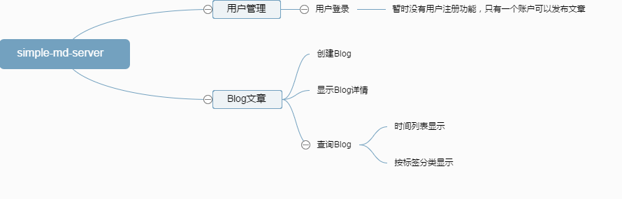

# 1. 为什么做这个Demo

用了几个 `Blog` 网站，但是如果一段时间不上，就会慢慢忘了那个网站的 `Blog` 维护。
或者有时遇到一个不错的 `Blog` 网站，这时又把 `Blog` 的内容写在新的网站上。原来老的
`Blog` 内容也难迁移。想做一个自己的 `Blog` 显示网站。这样就不容易掉内容了。

需求：

1. `Blog` 的内容容易迁移和管理，所以这里使用 `markdown` 的语法写 `Blog`, 并加上代码版本管理，这样迁移都很容易。

2. `Blog` 一般有文件的归档，或者查询，不可能一篇一篇 `Blog` 的浏览，查找不方便。这里使用数据库管理 `Blog` 归档信息。

综上需求，我们使用技术: `nodejs` + `mongodb`。需要实现功能，上脑图。

# 2. 这个 `Demo` 如何使用

类似于一般的 `github` `node` 项目。

  $ git clone github.com/kuangcaibao/simple-md-server.git
  $ cd simple-md-server
  $ npm install
  $ npm start

前提您已安装了 `node` 和 `mongodb`。

配置文件： `config.js`

# 3. 数据模型

  // blog
  var blogSchema = mongoose.Schema({
    title: String,
    labels: Array,
    publishTime: Date,
    abstract: String,
    filePath: String
  });

  // label
  var labelSchema = mongoose.Schema({
    label: String
  });

# 4. 路由

  router.get("/", blog.showHome);

  router.get("/login", user.showLogin);

  router.post("/login", user.login);

  router.get("/blog/create", user.isLogin, blog.showBlogCreate);

  router.post("/blog/create", user.isLogin, blog.blogCreate);

  router.get("/:blogId", blog.blogShowDetail);

  router.post("/api/blog/:blogFileName", blog.blogSendMdFile);

  router.post("/api/blogPageQuery", blog.queryBlogListPage);

  router.post("/api/labelQuery", label.findAll);

  router.get("/label/:label", blog.showBlogByLabel);

  router.post("/api/blogPageQueryByLabel", blog.queryBlogListPageByLabel);